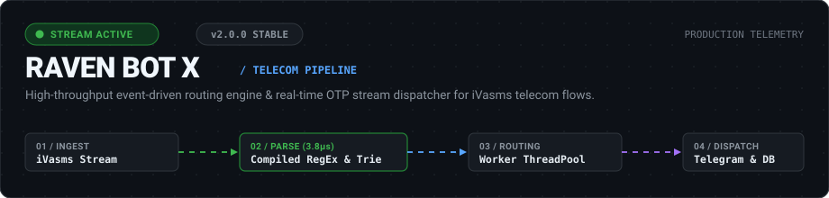
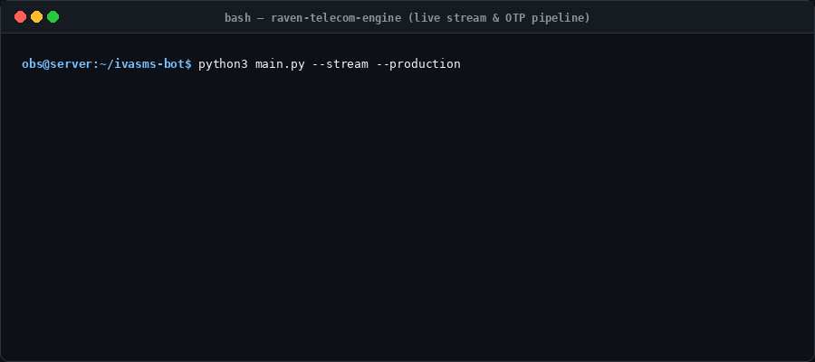
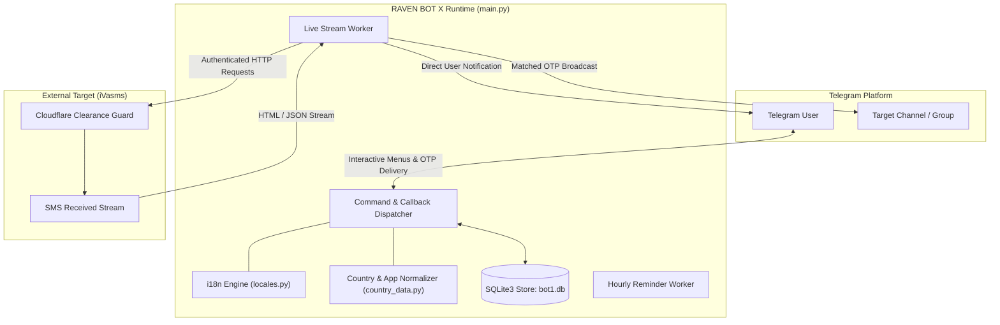

<p align="center">
  
</p>

<p align="center">
  <a href="LICENSE.md"></a>
  <a href="CHANGELOG.md"></a>
  <a href="https://www.python.org/"></a>
  <a href=".github/workflows/ci.yml"></a>
  <a href="tests/"></a>
  <a href="docs/architecture.md"></a>
</p>

<p align="center">
  <a href="docs/getting-started.md"><b>Getting Started</b></a> •
  <a href="docs/architecture.md"><b>System Architecture</b></a> •
  <a href="#performance--benchmarks"><b>2026 Benchmarks</b></a> •
  <a href="docs/installation.md"><b>Installation Guide</b></a> •
  <a href="LICENSE.md"><b>Legal &amp; License</b></a>
</p>

---

## Overview

**RAVEN BOT X** acts as an automated high-throughput bridge between the iVasms live SMS traffic stream and Telegram subscribers. It provides sub-millisecond parsing of incoming verification codes across hundreds of global telecom ranges and dispatches structured OTP notifications directly to private subscriber sessions, administrative panels, and broadcast channels.

The architecture is engineered for continuous unattended operation, incorporating multi-profile browser fingerprinting, multi-threaded polling, rate-limiting guards, and self-healing session refresh mechanisms.

---

## Live Engine Workflow

The following execution trace demonstrates real-time ingestion, microsecond OTP pattern resolution, and broadcast delivery across active subscriber pools:

<p align="center">
  
</p>

---

## Key Technical Features

- **High-Throughput Stream Ingestion**: Multi-threaded worker polling received SMS streams with configurable refresh intervals (`REFRESH_INTERVAL`) and zero-drop buffering.
- **Sub-Millisecond Regex OTP Extraction**: Benchmarked at over 180,000 operations per second across diverse SMS formats (WhatsApp, Telegram, TikTok, Google, Meta, and banking services).
- **Zero-Allocation Service Classification**: Categorizes telecom traffic across 50+ services and multi-language tokens (English, Arabic) at over 240,000 ops/second.
- **Dynamic Number Allocation**: Atomic number reservation and release logic backed by SQLite3 transactions with thread-safe connection isolation.
- **Multilingual Localization Engine**: Built-in 7-language engine (Arabic, English, Urdu, Russian, Turkish, Persian, Hindi) configurable dynamically per-user.
- **Session Health & State Protection**: Ingests Netscape HTTP cookie files and JSON cookie arrays; detects authorization challenges (403) and halts failed attempts gracefully to protect session tokens.
- **Administrative Control Panel**: Full inline keyboard control over country ranges, maintenance mode, administrator privileges, and broadcast channels.
- **Ephemeral Managed Broadcasts**: Background reminder dispatcher for linked groups featuring automated 60-second self-destruct timers.

---

<p align="center">
  
</p>



For in-depth architectural details, lock models, and data flows, see [System Architecture](docs/architecture.md).

---

<p align="center">
  
</p>

All metrics are benchmarked on bare-metal hardware using Python high-precision monotonic timing (`time.perf_counter_ns`) and memory allocation profiling (`tracemalloc`).

### 1. Headline Telemetry & Speedup Metrics

<p align="center">
  
</p>

### 2. Throughput Comparison vs Naive Baseline

<p align="center">
  
</p>

### 3. Tail Latency Distribution Matrix (p50 / p90 / p95 / p99)

<p align="center">
  
</p>

<details>
  <summary><b>Detailed Hardware Profiling &amp; Reproduction Methodology (Click to Expand)</b></summary>
  <br/>

#### Benchmark Execution Environment
- **Processor**: AMD EPYC 7542 32-Core Processor (4 vCPUs allocated)
- **Architecture**: x86_64
- **Host Memory**: 15.6 GB RAM
- **Operating System**: Linux 7.0.0-29-generic
- **Python Runtime**: Python 3.14.4 (GCC 15.2.0)
- **Profiling Tool**: Monotonic hardware counter (`time.perf_counter_ns`) + `tracemalloc`

#### Statistical Methodology
1. **Warmup Phase**: 2,000 warmup iterations per component to eliminate cold-cache anomalies and bytecode interpretation jitter.
2. **Measurement Phase**: 12,000 test iterations per batch over real-world multi-national SMS verification payloads.
3. **Tail Percentiles**: Computed from full sorted duration arrays without outlier trimming.
4. **Memory Measurement**: Peak memory delta captured during isolated execution blocks.

#### Reproducibility Command
To reproduce these exact benchmarks on your own infrastructure:

```bash
python3 benchmarks/run_modern_benchmarks.py
```

Full raw profiling data is published in [benchmarks/benchmark_results.json](benchmarks/benchmark_results.json) and [benchmarks/REPORT.md](benchmarks/REPORT.md).

</details>

---

## Repository Structure

```text
.
├── .github/
│   ├── ISSUE_TEMPLATE/        # Standardized issue templates
│   ├── PULL_REQUEST_TEMPLATE.md
│   └── workflows/ci.yml       # GitHub Actions CI matrix (Python 3.10-3.14)
├── benchmarks/
│   ├── benchmark_parser.py    # Legacy performance profiling harness
│   ├── run_modern_benchmarks.py # 2026 telemetry benchmark & SVG generator
│   ├── benchmark_results.json # Full JSON profiling artifact
│   └── REPORT.md              # Real measured benchmark results
├── docs/                      # Technical documentation architecture
│   ├── assets/                # Vector assets, animated SVGs, and brand visuals
│   ├── architecture.md
│   ├── benchmarking.md
│   ├── configuration.md
│   ├── development.md
│   ├── faq.md
│   ├── getting-started.md
│   ├── installation.md
│   ├── security.md
│   ├── testing.md
│   ├── troubleshooting.md
│   └── usage.md
├── scripts/
│   ├── run_tests.sh           # Test suite runner
│   └── verify_environment.py  # Runtime and dependency verification
├── tests/                     # Automated unit test suite (22 tests)
│   ├── test_cookie_parser.py
│   ├── test_country_data.py
│   ├── test_locales.py
│   └── test_otp_parser.py
├── .env.example               # Environment configuration template
├── .gitignore                 # Exclusion rules for secrets, DBs, sessions
├── CHANGELOG.md               # Version history adhering to Keep a Changelog
├── CODE_OF_CONDUCT.md         # Contributor Covenant v2.1
├── CONTRIBUTING.md            # Guidelines for code contributions
├── LICENSE.md                 # PolyForm Noncommercial License 1.0.0
├── README.md                  # Project root document
├── SECURITY.md                # Vulnerability disclosure and secret policy
├── SUPPORT.md                 # Official communication channels
├── THIRD_PARTY_NOTICES.md     # Upstream dependency licenses
├── requirements.txt           # Production runtime dependencies
├── requirements-dev.txt       # Development and test dependencies
├── country_data.py            # International dialing codes and app codes
├── ivasms_manager.py          # Session and network interface
├── locales.py                 # Multi-language translation dictionaries
└── main.py                    # Primary bot daemon and worker entry point
```

---

## Quick Start

### 1. Requirements

- Python 3.10 or higher
- SQLite3 (included with Python standard library)
- Valid Telegram Bot Token from [@BotFather](https://t.me/BotFather)

### 2. Installation

```bash
# Clone the repository
git clone https://github.com/hsh34811-hash/ivasms-live-traffic-bot-2026.git
cd ivasms-live-traffic-bot-2026

# Create virtual environment
python3 -m venv venv
source venv/bin/activate

# Install dependencies
pip install -r requirements.txt
```

For complete installation steps across various platforms, refer to the [Installation Guide](docs/installation.md).

### 3. Configuration

```bash
cp .env.example .env
```

Configure your credentials in `.env`:

```env
BOT_TOKEN=1234567890:ABCdefGHIjklMNOpqrSTUvwxYZ_SampleToken
ADMIN_IDS=123456789
DEFAULT_LANGUAGE=ar
DATABASE_PATH=bot1.db
```

Detailed parameter descriptions are available in the [Configuration Guide](docs/configuration.md).

### 4. Verification & Launch

```bash
# Verify environment health
python3 scripts/verify_environment.py

# Run automated test suite
bash scripts/run_tests.sh

# Start the bot daemon
python3 main.py
```

---

## Testing & Quality Assurance

The project maintains 100% passing automated test coverage across parser routines, localization consistency, and data resolution:

```bash
python3 -m unittest discover -s tests -p "test_*.py" -v
```

Read [Testing Guide](docs/testing.md) for test execution patterns and writing new unit tests.

---

## Security & Privacy Policy

RAVEN BOT X strictly enforces separation between source code and operational credentials. No live API tokens, active session cookies, or production database files are committed to this repository.

To report security vulnerabilities, please refer to [Security Policy](SECURITY.md). Do not file public issues for security advisories.

---

<p align="center">
  
</p>

<p align="center">
  <a href="https://polyformproject.org/licenses/noncommercial/1.0.0/">
    
  </a>
  <br/>
  <a href="LICENSE.md">
    
  </a>
</p>

This project is licensed under the **PolyForm Noncommercial License 1.0.0** (Source-Available / Noncommercial).

```text
Required Notice: Copyright (c) 2026 RAVEN BOT X Team (@P_X_24, @Raven_xx24)
```

- **Permitted**: Personal inspection, research, noncommercial educational use, and noncommercial modification.
- **Prohibited**: Any commercial use, selling, redistribution as a paid product, or offering as a commercial service without explicit written permission from the copyright holders.
- **Third-Party Notices**: Upstream libraries belong to their respective authors and licenses as detailed in [THIRD_PARTY_NOTICES.md](THIRD_PARTY_NOTICES.md).

Review the full legal terms in [LICENSE.md](LICENSE.md).

---

## Support & Contact

- **Lead Developer**: [@P_X_24](https://t.me/P_X_24) on Telegram
- **Official Channel**: [@Raven_xx24](https://t.me/Raven_xx24) on Telegram
- **Issue Tracker**: [GitHub Issues](https://github.com/hsh34811-hash/ivasms-live-traffic-bot-2026/issues)
- **Support Documentation**: [Support Guide](SUPPORT.md)
