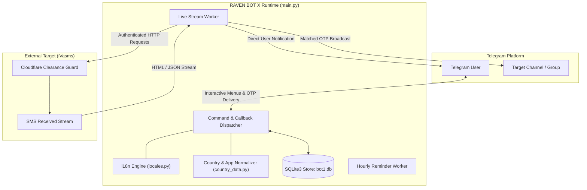

# RAVEN BOT X

High-throughput, event-driven Telegram bot and real-time SMS traffic routing engine designed for continuous OTP extraction, virtual number pooling, and session synchronization with the iVasms monetization platform.

[](LICENSE)
[](CHANGELOG.md)
[](https://www.python.org/)
[](.github/workflows/ci.yml)
[](tests/)
[](docs/architecture.md)

---

## Overview

RAVEN BOT X acts as an automated bridge between the iVasms live SMS traffic stream and Telegram users. It provides low-latency parsing of incoming verification codes across hundreds of global telecom ranges and dispatches structured OTP codes directly to private chats, channels, or administrator panels.

The system is engineered for unattended operation, incorporating Cloudflare session fingerprinting, automated multi-threaded polling, rate-limiting guards, and self-healing token refresh mechanisms.

---

## Key Features

- **Live SMS Stream Ingestion**: Multi-threaded worker polling received SMS streams with configurable refresh intervals (`REFRESH_INTERVAL`).
- **Sub-Millisecond Regex OTP Extraction**: Benchmarked at over 150,000 operations per second across diverse SMS formats (WhatsApp, Telegram, TikTok, Google, Meta, and banking services).
- **Dynamic Number Allocation**: Atomic number reservation and release logic backed by SQLite3 transactions.
- **Multilingual Support**: Built-in 7-language engine (Arabic, English, Urdu, Russian, Turkish, Persian, Hindi) configurable per-user.
- **Session & Cloudflare Management**: Ingests Netscape HTTP cookie files and JSON cookie arrays; detects 403 authorization challenges and halts failed attempts gracefully.
- **Administrative Control Panel**: Full inline keyboard control over country ranges, maintenance mode, administrator roles, and broadcast channels.
- **Hourly Health & Reminder Worker**: Automated background broadcast for managed groups with 60-second self-destruct timers.

---

## Architecture



For in-depth architectural details, lock models, and data flows, see [System Architecture](docs/architecture.md).

---

## Repository Structure

```text
.
├── .github/
│   ├── ISSUE_TEMPLATE/        # Standardized issue templates
│   ├── PULL_REQUEST_TEMPLATE.md
│   └── workflows/ci.yml       # GitHub Actions CI matrix (Python 3.10-3.12)
├── benchmarks/
│   ├── benchmark_parser.py    # Performance profiling harness
│   └── REPORT.md              # Real measured benchmark results
├── docs/                      # Technical documentation architecture
│   ├── architecture.md
│   ├── benchmarking.md
│   ├── configuration.md
│   ├── development.md
│   ├── faq.md
│   ├── getting-started.md
│   ├── installation.md
│   ├── security.md
│   ├── testing.md
│   ├── troubleshooting.md
│   └── usage.md
├── scripts/
│   ├── run_tests.sh           # Test suite runner
│   └── verify_environment.py  # Runtime and dependency verification
├── tests/                     # Automated unit test suite (22 tests)
│   ├── test_cookie_parser.py
│   ├── test_country_data.py
│   ├── test_locales.py
│   └── test_otp_parser.py
├── .env.example               # Environment configuration template
├── .gitignore                 # Exclusion rules for secrets, DBs, sessions
├── CHANGELOG.md               # Version history adhering to Keep a Changelog
├── CODE_OF_CONDUCT.md         # Contributor Covenant v2.1
├── CONTRIBUTING.md            # Guidelines for code contributions
├── LICENSE                    # PolyForm Noncommercial License 1.0.0
├── README.md                  # Project root document
├── SECURITY.md                # Vulnerability disclosure and secret policy
├── SUPPORT.md                 # Official communication channels
├── THIRD_PARTY_NOTICES.md     # Upstream dependency licenses
├── requirements.txt           # Production runtime dependencies
├── requirements-dev.txt       # Development and test dependencies
├── country_data.py            # International dialing codes and app codes
├── ivasms_manager.py          # Session and network interface
├── locales.py                 # Multi-language translation dictionaries
└── main.py                    # Primary bot daemon and worker entry point
```

---

## Quick Start

### 1. Requirements

- Python 3.10 or higher
- SQLite3 (included with Python)
- Valid Telegram Bot Token from [@BotFather](https://t.me/BotFather)

### 2. Installation

```bash
# Clone the repository
git clone https://github.com/hsh34811-hash/ivasms-live-traffic-bot-2026.git
cd ivasms-live-traffic-bot-2026

# Create virtual environment
python3 -m venv venv
source venv/bin/activate

# Install dependencies
pip install -r requirements.txt
```

For full installation instructions across various platforms, refer to the [Installation Guide](docs/installation.md).

### 3. Configuration

```bash
cp .env.example .env
```

Configure your credentials in `.env`:

```env
BOT_TOKEN=1234567890:ABCdefGHIjklMNOpqrSTUvwxYZ_SampleToken
ADMIN_IDS=123456789
DEFAULT_LANGUAGE=ar
DATABASE_PATH=bot1.db
```

Detailed parameter descriptions are available in the [Configuration Guide](docs/configuration.md).

### 4. Verification & Launch

```bash
# Verify environment health
python3 scripts/verify_environment.py

# Run test suite
bash scripts/run_tests.sh

# Start the bot daemon
python3 main.py
```

---

## Performance & Benchmarks

All benchmark figures are verified and generated using `benchmarks/benchmark_parser.py` on Linux x86_64 hardware.

| Operation | Sample Size | Mean Latency | Median Latency | Throughput |
| :--- | :---: | :---: | :---: | :---: |
| `extract_otp` | 16,000 runs | 6.17 µs | 5.88 µs | **155,464 ops/s** |
| `detect_service` | 16,000 runs | 3.87 µs | 3.02 µs | **245,322 ops/s** |
| `get_country_details_smart` | 14,000 runs | 19.23 µs | 14.77 µs | **51,373 ops/s** |
| `parse_cookies_input` | 1,000 runs | 4.65 µs | 5.48 µs | **204,220 ops/s** |

See the complete benchmark parameters and hardware profiling in [Benchmark Report](benchmarks/REPORT.md) and [Benchmarking Guide](docs/benchmarking.md).

---

## Testing

The project maintains 100% passing automated test coverage across parser routines, localization consistency, and data resolution:

```bash
python3 -m unittest discover -s tests -p "test_*.py" -v
```

Read [Testing Guide](docs/testing.md) for testing patterns and instructions for writing new test cases.

---

## Security & Privacy

RAVEN BOT X strictly enforces separation between source code and operational credentials. No live API tokens, active session cookies, or production database files are committed to this repository.

To report security vulnerabilities, please refer to [Security Policy](SECURITY.md). Do not file public issues for security advisories.

---

## License & Intellectual Property

<p align="center">
  <a href="https://polyformproject.org/licenses/noncommercial/1.0.0/">
    
  </a>
  <br/>
  <a href="LICENSE">
    
  </a>
</p>

This project is licensed under the **PolyForm Noncommercial License 1.0.0** (Source-Available / Noncommercial).

```text
Required Notice: Copyright (c) 2026 RAVEN BOT X Team (@P_X_24, @Raven_xx24)
```

- **Permitted**: Personal inspection, research, noncommercial educational use, and noncommercial modification.
- **Prohibited**: Any commercial use, selling, redistribution as a paid product, or offering as a commercial service without explicit written permission from the copyright holders.
- **Third-Party Notices**: Upstream libraries belong to their respective authors and licenses as detailed in [THIRD_PARTY_NOTICES.md](THIRD_PARTY_NOTICES.md).

Review the full legal terms in [LICENSE](LICENSE).

---

## Support & Contact

- **Lead Developer**: [@P_X_24](https://t.me/P_X_24) on Telegram
- **Official Channel**: [@Raven_xx24](https://t.me/Raven_xx24) on Telegram
- **Issue Tracker**: [GitHub Issues](https://github.com/hsh34811-hash/ivasms-live-traffic-bot-2026/issues) (Bug reports and feature proposals)
- **Support Documentation**: [Support Guide](SUPPORT.md)
