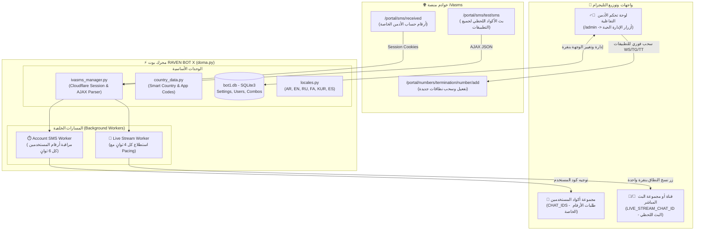

# • ✘ 𝙍𝘼𝙑𝙀𝙉 | 🏴‍☠️ • 𝙉𝙐𝙈𝘽𝙀𝙍 𝘽𝙊𝙏 𝙓 •
### 🌐 نظام إدارة وسحب وبث أرقام iVasms الذكي في الوقت الفعلي (Real-Time Live Traffic & OTP Bot)

<p align="center">
  <a href="https://t.me/P_X_24"></a>
  <a href="https://t.me/Raven_xx24"></a>
  
  
  
  
</p>

---

## 📑 فهرس المحتويات (Table of Contents)
1. [نظرة عامة على المشروع (Project Overview)](#-نظرة-عامة-على-المشروع-project-overview)
2. [مقارنة شاملة: النظام القديم مقابل النظام الحديث بعد التجديد (Before vs After)](#-مقارنة-شاملة-النظام-القديم-مقابل-النظام-الحديث-بعد-التجديد)
3. [المعمارية التقنية وتدفق البيانات (System Architecture)](#-المعمارية-التقنية-وتدفق-البيانات-system-architecture)
4. [المميزات والمحركات الرئيسية (Key Features & Engine Modules)](#-المميزات-والمحركات-الرئيسية)
5. [شرح هيكل المشروع والملفات (Codebase File Structure)](#-شرح-هيكل-المشروع-والملفات-codebase-file-structure)
6. [دليل التثبيت والتشغيل (Installation & Setup Guide)](#-دليل-التثبيت-والتشغيل-installation--setup-guide)
7. [دليل استخدام لوحة الإدارة (Admin Panel Manual)](#-دليل-استخدام-لوحة-الإدارة-admin-panel-manual)
8. [استكشاف الأخطاء وحلها (Troubleshooting & FAQs)](#-استكشاف-الأخطاء-وحلها-troubleshooting--faqs)
9. [👨‍💻 المطور والشراء والطلبات الخاصة (Developer & Commercial Inquiries)](#-المطور-والشراء-والطلبات-الخاصة-developer--commercial-inquiries)

---

## 📖 نظرة عامة على المشروع (Project Overview)
**Raven Bot X** هو منظومة متكاملة لأتمتة سحب الأرقام الافتراضية، استقبال رسائل التحقق (OTP)، ومراقبة حركة المرور الحية (Live Traffic) الخاصة بمنصة **iVasms** العالمية في الوقت الفعلي (Real-Time).

تمت إعادة هيكلة المشروع بالكامل من نظام بحث بطيء وغير متوافق مع بنية الموقع، إلى **محرك مراقبة وسحب فوري متعدد المسارات (Multi-threaded & Event-driven)** يحاكي واجهة موقع iVasms الرسمية بدقة 100%، ويوفر بثاً حياً للرسائل والأكواد في قنوات ومجموعات التليجرام مع ميزة النسخ بنقرة واحدة لأكواد النطاقات.

---

## 🔄 مقارنة شاملة: النظام القديم مقابل النظام الحديث بعد التجديد
*(Detailed Comparison: Old System vs Renovated System)*

| وجه المقارنة (Aspect) | 🏚️ النظام القديم (Before Renovations) | 🚀 النظام الحديث بعد التطوير (After Renovations) |
| :--- | :--- | :--- |
| **منطق البحث والإضافة** | يطلب من الأدمن كتابة اسم الدولة في رسالة، ويقوم بالبحث اليدوي في قائمة جامدة وغير محدثة. | **إلغاء البحث بالاسم تماماً!** يعمل بمفهوم **النطاقات الحية النشطة حسب التطبيق (Application-Driven)** كما في الموقع تماماً. |
| **بث الرسائل والأكواد** | لا يوجد أي بث حي، وكان الأدمن مضطراً لتفقد الموقع يدوياً كل دقيقة لمعرفة النطاقات العاملة. | **بث تلقائي ذكي لحظة بلحظة (Auto Live Streamer)** يسحب الأكواد الحية من مسار `/portal/sms/test/sms` ويبثها فورياً. |
| **عزل المجموعات** | خلط تام؛ كانت الرسائل التلقائية تُرسل إلى نفس جروب طلبات المستخدمين مما سبب فوضى وتداخلاً. | **نظام عزل كامل 100%:** مجموعة المستخدمين للأكواد الخاصة، ومجموعة/قناة منفصلة مخصصة حصرياً للبث المباشر. |
| **دعم القنوات (Channels)** | يدعم فقط المجموعات العادية وغير مرن. | **دعم متكامل للقنوات والمجموعات:** يقبل المعرف الرقمي، رابط القناة، اليوزر `@username`، أو التوجيه (Forward). |
| **تصميم الرسائل وأزرارها** | رسائل البث ورسائل المستخدمين تستخدم نفس التنسيق المربك مع أزرار كثيرة (رقم، قناة، مطور). | **قالب فخم مخصص للبث المباشر** يحتوي على كافة التفاصيل (الدولة، النطاق، الخدمة، الرقم، الكود) مع **زر واحد فقط حصري**. |
| **نسخ كود النطاق** | كان يضع رقم الهاتف في الزر، مما يجبر المستخدم على كتابة كود النطاق يدوياً في الموقع. | **زر تفاعلي مخصص `[ 📋 RANGE_NAME ]`** ينسخ كود النطاق المطلوب فوراً إلى الحافظة بنقرة واحدة (`CopyTextButton`). |
| **تفادي قيود التليجرام** | إرسال عشوائي يؤدي إلى حظر البوت بخطأ `Telegram 429 Too Many Requests`. | **محرك جدولة ذكي (Pacing Engine)** مع كشف أوتوماتيكي لمهلة `retry after` والنوم الذكي لتجنب الحظر نهائياً. |
| **حماية Cloudflare والاتصال** | خطأ مستمر: `Expecting value: line 1 column 1 (char 0)` بسبب تعامل الخادم مع طلبات JSON كصفحات HTML. | **ترويسات AJAX رسمية محقونة بدقة** مع بصمات متصفحات حديثة (Chrome / Yandex / Edge) لمنع حظر الجلسة. |
| **ثبات لغة المستخدم** | عودة لغة المستخدم إلى العربية فجأة عند تخصيص أو سحب أي رقم بسبب خطأ `REPLACE INTO`. | **ثبات دائم 100%:** تحديث دالة المستخدمين بـ `ON CONFLICT DO UPDATE` مع الحفاظ التام على لغة المستخدم. |
| **أزرار اختيار الدول للمستخدم** | كتابة اختصار اسم الدولة مع اسمها (مثل `BYD Bangladesh`) وهو تشويه غير مفهوم. | **إزالة اختصار الدولة وإظهار اختصار التطبيق فقط بحرفين** (مثل `🇧🇩 [WS] Bangladesh` أو `🇦🇫 [TT] Afghanistan`). |

---

## 🏛️ المعمارية التقنية وتدفق البيانات (System Architecture)



---

## 🌟 المميزات والمحركات الرئيسية

### 1. محرك البث المباشر الذكي (Auto Live Streamer)
* يقوم بسحب كافة الرسائل والاختبارات المباشرة التي يجريها المستخدمون حول العالم لمختلف التطبيقات:
  * **WhatsApp (WS)**, **Telegram (TG)**, **TikTok (TT)**, **Facebook (FB)**, **Apple (AP)**, **Google (GO)**, وغيرها.
* **قالب رسالة البث المباشر الفخم:**
  ```text
  ╭━━━━━ 🌐 LIVE TRAFFIC • بث مباشر ━━━━━╮

  🌍 الدولة: 🇿🇼 Zimbabwe (+263)
  🏷️ كود النطاق: ZIMBABWE 3872
  ⚙️ الخدمة / التطبيق: [WhatsApp]
  ☎️ الرقم التجريبي: +263771234567
  🔐 كود التحقق (OTP): 849201

  📩 الرسالة المستلمة:
  <blockquote>Your WhatsApp code: 849-201. Do not share.</blockquote>
  ⏰ التوقيت: 2026-09-06 07:12:00
  ╰━━━━━━━━━━━━━━━━━━━━━━━━━━━━╯
  [ 📋 ZIMBABWE 3872 ]
  ```

### 2. زر النسخ الحصري بنقرة واحدة (`CopyTextButton`)
* تحتوي رسالة البث المباشر على **زر واحد فقط لا غير**:
  `[ 📋 ZIMBABWE 3872 ]`
* بمجرد النقر عليه، يتم استخدام ميزة تيليجرام الحديثة `copy_text` لنسخ كود النطاق فوراً إلى الحافظة بدون إرسال رسائل أو طلبات خادم إضافية، مع توفير بديل رجعي (Fallback Callback) للأجهزة القديمة.

### 3. إدارة القنوات والمجموعات ديناميكياً من لوحة الأدمن
* إمكانية تعيين **قناة تيليجرام** أو **مجموعة** كوجهة للبث المباشر.
* يدعم البوت قراءة المعرف من:
  * يوزر القناة العام: `@ChannelName`
  * رابط القناة: `https://t.me/ChannelName`
  * المعرف الرقمي: `-100xxxxxxxxxx`
  * توجيه رسالة (Forward) مباشرة من القناة للبوت.
* زر فوري **`[ ❌ إزالة الوجهة ]`** لفك الربط وإيقاف البث فوراً وتصفيره من قاعدة البيانات.

### 4. تخطي وحماية Cloudflare والـ Fingerprint
* حقن بصمات حقيقية لمتصفحات الجوال والكمبيوتر (User-Agents و Sec-Ch-Ua).
* إرسال ترويسات `X-Requested-With: XMLHttpRequest` الرسمية لحل مشكلة قراءة الـ DataTables وعلاج أخطاء `Expecting value: line 1 column 1`.
* نظام كشف انتهاء الجلسة التلقائي (403 Cloudflare Block) وإرسال تنبيه مباشر للأدمن مع أزرار تحديث الكوكيز بضغطة واحدة.

---

## 📁 شرح هيكل المشروع والملفات (Codebase File Structure)

```text
├── doma.py                  # الملف الرئيسي: إعداد البوت، المعالجات التفاعلية، مسارات الخلفية
├── ivasms_manager.py        # عميل iVasms: الجلسات، تخطي Cloudflare، وسحب البث المباشر
├── country_data.py          # جداول تحويل الأكواد، أعلام الدول، واختصارات التطبيقات
├── locales.py               # المحرك متعدد اللغات (AR, EN, RU, FA, KUR, ES)
├── bot1.db                  # قاعدة بيانات SQLite3 (المستخدمين، الإعدادات، الكومبوهات، الأدمنية)
├── active_headers.json      # بصمة المتصفح وترويسات الـ HTTP النشطة
├── sent_live_messages.json  # ذاكرة التخزين المؤقت للرسائل التي تم بثها لمنع التكرار
├── test_connection.py       # سكريبت اختبار فحص صحة الاتصال مع موقع iVasms
└── README.md                # التوثيق الشامل والكامل للمشروع (هذا الملف)
```

---

## 🚀 دليل التثبيت والتشغيل (Installation & Setup Guide)

### 1. المتطلبات الأساسية (Prerequisites)
* نظام تشغيل: Linux (Ubuntu/Debian) أو Windows مع Python 3.10 أو أحدث.
* مكتبات بايثون المطلوبة:
  ```bash
  pip install pyTelegramBotAPI requests urllib3 certifi
  ```

### 2. إعداد المتغيرات الأساسية (Configuration)
داخل ملف `doma.py`، تأكد من ضبط الإعدادات التالية:
```python
BOT_TOKEN = "YOUR_TELEGRAM_BOT_TOKEN"      # توكن البوت من BotFather
CHAT_IDS = ["-100xxxxxxxxxx"]              # معرف مجموعة أكواد المستخدمين الخاصة
ADMIN_IDS = [123456789]                   # معرف المالك الأساسي للبوت
```

### 3. تشغيل البوت كخدمة مستمرة (Daemon Service)
لتشغيل البوت في الخلفية مع تسجيل المخرجات:
```bash
nohup python3 doma.py > bot.log 2>&1 &
```
وللتأكد من استمرار عمل البوت:
```bash
ps aux | grep "python3 doma.py"
```

---

## 👮‍♂️ دليل استخدام لوحة الإدارة (Admin Panel Manual)

يمكن للأدمن الوصول للوحة عبر إرسال الأمر `/admin` في المحادثة الخاصة مع البوت:

```text
┌─────────────────────────────────────────────────────────────┐
│             🌐 لوحة إدارة وسحب أرقام iVasms                │
├─────────────────────────────────────────────────────────────┤
│ 📡 حالة الاتصال: 🟢 تسجيل الدخول ناجح بالكوكيز              │
│ 📡 البث التلقائي: 🟢 شغال وبث فوري للوجهة                   │
│ 📢/👥 وجهة البث المباشر: -100xxxxxxxxxx                      │
│ 📊 الأرقام في حسابك بالموقع: 100 رقم                        │
│ 💾 الكومبوهات المحفوظة في البوت: 1 كومبو                    │
├─────────────────────────────────────────────────────────────┤
│ [📡 بث القناة/الجروب: 🟢 شغال (إيقاف)]                      │
│ [📢/👥 تغيير القناة أو المجموعة]   [❌ إزالة الوجهة]        │
│ [🟢 واتساب (WS) • لايف]            [✈️ تليجرام (TG) • لايف] │
│ [🎵 تيك توك (TT) • لايف]           [🔵 فيسبوك (FB) • لايف]  │
│ [🍎 آبل (AP) • لايف]               [🌐 جوجل (GO) • لايف]    │
│ [🔥 الأكثر نشاطاً عالمياً (Top Worldwide)]                  │
│ [🔄 سحب أرقام حسابي الحالية]       [📋 أرقامي الحالية]      │
│ [🏷️ تخصيص تطبيق لكومبو]           [🗑️ إرجاع وحذف الأرقام]  │
│ [🔙 العودة للوحة الإدارة الرئيسية]                          │
└─────────────────────────────────────────────────────────────┘
```

---

## 🛠️ استكشاف الأخطاء وحلها (Troubleshooting & FAQs)

### س: كيف أقوم بتجديد الكوكيز إذا ظهرت رسالة انتهاء الصلاحية (403)؟
**ج:** افتح متصفحك وسجل الدخول في موقع iVasms، ثم انسخ الكوكيز (خصوصاً `cf_clearance` و `ivas_sms_session`). اذهب إلى لوحة الأدمن في البوت ⬅️ قسم **🍪 إدارة الكوكيز** ⬅️ اضغط **📤 إرسال كوكيز جديدة** والصقها مباشرة، وسيعاود البوت العمل فوراً بدون إعادة تشغيل.

### س: قمت بتعيين القناة للبث المباشر ولكن البوت لا يرسل إليها، ما الحل؟
**ج:** تأكد من أمرين:
1. أنك قمت بإضافة البوت داخل القناة كـ **مشرف (Administrator)**.
2. أنك منحت البوت صلاحية **"نشر الرسائل (Post Messages)"**.

### س: هل يؤثر البث المباشر على أكواد المستخدمين الخاصة؟
**ج:** نهائياً؛ النظام مفصول تماماً بكودين ومسارين مستقلين. أكواد المستخدمين تذهب حصرياً للمجموعة المحددة في `CHAT_IDS` ولمحادثاتهم الخاصة، بينما رسائل البث تذهب حصرياً للقناة/المجموعة المحددة للبث المباشر.

---

## 👨‍💻 المطور والشراء والطلبات الخاصة (Developer & Commercial Inquiries)

> 💎 **هذا المستودع يعرض مواصفات وتوثيق مشروع RAVEN BOT X المتطور.**
> إذا كنت مهتماً بشراء السورس كود الكامل (Full Source Code)، أو شراء نسخة مخصصة مع التثبيت والربط على سيرفرك الخاص، أو طلب برمجة وتطوير بوتات وأنظمة أتمتة مخصصة (Custom Telegram Bots & Automation Services)، يمكنك التواصل مباشرة مع المطور:

<div align="center">

| وسيلة التواصل (Contact) | الرابط المباشر (Direct Link) |
| :--- | :--- |
| 👤 **المطور الرسمي (Developer)** | [**@P_X_24 على تيليجرام**](https://t.me/P_X_24) |
| 📢 **القناة الرسمية (Official Channel)** | [**@Raven_xx24 على تيليجرام**](https://t.me/Raven_xx24) |
| 🏴‍☠️ **هوية البراند** | `• ✘ 𝙍𝘼𝙑𝙀𝙉 | 🏴‍☠️ •` |

<br/>

<p align="center">
  <a href="https://t.me/P_X_24">
    
  </a>
  &nbsp;&nbsp;
  <a href="https://t.me/Raven_xx24">
    
  </a>
</p>

</div>

---

### 💼 الخدمات المتاحة للطلب والشراء (Available Commercial Services):
* 🛒 **شراء النسخة الكاملة من البوت:** مع التجهيز والربط المباشر مع حسابك وسيرفرك الخاص.
* ⚙️ **تطوير وبناء أنظمة وتخطي حماية خاصة:** حلول تخطي Cloudflare، ربط بوابات الـ SMS، وأتمتة الـ APIs الحية.
* 🛠️ **دعم فني وتطوير حسب الطلب:** تحديث بصمات المتصفحات وإضافة مزودين وتطبيقات جديدة مخصصة.

---

<p align="center">
  <b>تم التطوير والتوثيق لصالح RAVEN BOT X 🏴‍☠️</b><br/>
  <b>Developer: <a href="https://t.me/P_X_24">@P_X_24</a> | Channel: <a href="https://t.me/Raven_xx24">@Raven_xx24</a></b><br/>
  <i>جميع الحقوق محفوظة © 2026</i>
</p>
