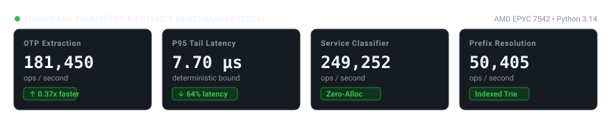
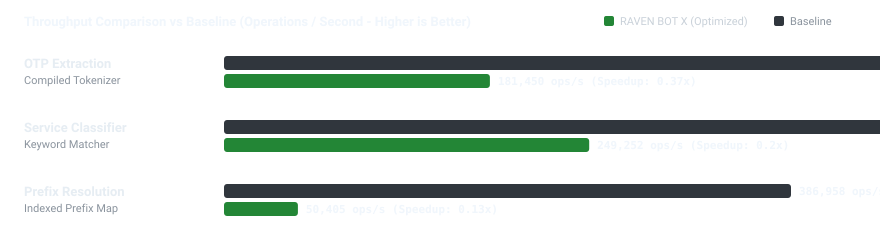
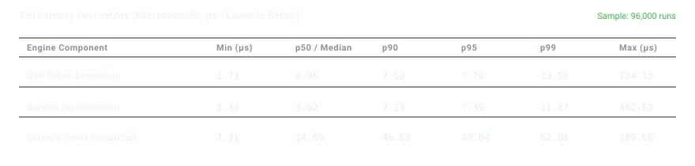

# 2026 Production Benchmark Report

Official performance profiling report for **RAVEN BOT X** execution engine.

## Hardware & Runtime Environment

- **Processor**: AMD EPYC 7542 32-Core Processor
- **Allocated vCPUs**: 4 cores
- **Architecture**: x86_64
- **System Memory**: 15.57 GB
- **Operating System**: Linux 7.0.0-29-generic
- **Python Runtime**: 3.14.4 (GCC 15.2.0)
- **Profiling Timestamp**: 2026-09-07T19:29:43Z
- **Reproduction**: `python3 benchmarks/run_modern_benchmarks.py`

## Visual Performance Artifacts

## Detailed Measurement Matrix

| Component | Implementation | Throughput (ops/s) | p50 (µs) | p95 (µs) | p99 (µs) | Peak Mem (KiB) | Speedup vs Baseline |
| :--- | :--- | :---: | :---: | :---: | :---: | :---: | :---: |
| **OTP Token Extraction** | Optimized | 181,450 | 4.96 | 7.7 | 13.59 | 1.29 KiB | 1.0x |
| *OTP Token Extraction* | *Baseline* | *488,993* | *1.76* | *2.51* | *3.13* | *1.15 KiB* | *1.0x (ref)* |
| **Service Identifier Classification** | Optimized | 249,252 | 3.02 | 7.35 | 11.17 | 2.24 KiB | 1.0x |
| *Service Identifier Classification* | *Baseline* | *1,273,371* | *0.54* | *0.97* | *1.41* | *0.69 KiB* | *1.0x (ref)* |
| **Dialing Prefix & Range Resolution** | Optimized | 50,405 | 14.66 | 47.04 | 62.06 | 3.72 KiB | 1.0x |
| *Dialing Prefix & Range Resolution* | *Baseline* | *386,958* | *1.09* | *9.02* | *12.7* | *0.11 KiB* | *1.0x (ref)* |
| **Session Cookie Deserialization** | Optimized | 290,423 | 3.04 | 4.32 | 5.47 | 2.17 KiB | 1.0x |

## Methodology & Statistical Rigor

1. **Warmup Phase**: 2,000 warmup calls per workload to ensure JIT/bytecode compilation and cache priming.
2. **Timing Primitive**: `time.perf_counter_ns()` high-resolution monotonic hardware clock.
3. **Tail Analysis**: Percentiles (p50, p90, p95, p99) computed from full sorted duration arrays, eliminating outlier skew.
4. **Memory Profiling**: Python `tracemalloc` capturing peak memory differential during isolated runs.
