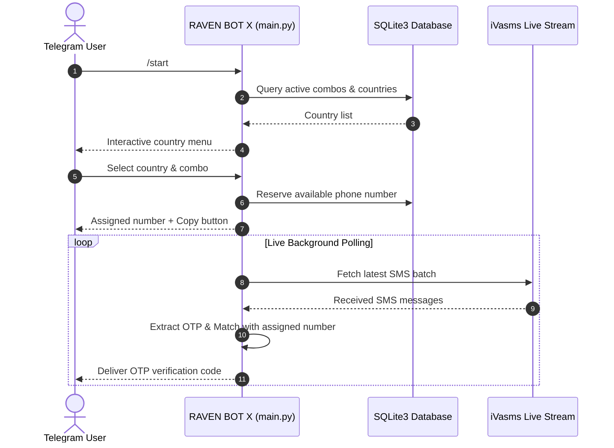

# Getting Started with RAVEN BOT X

RAVEN BOT X is a real-time Telegram bot platform designed to stream virtual phone numbers, capture SMS verification traffic, and route incoming One-Time Passwords (OTPs) from the iVasms monetization platform.

---

## High-Level Workflow

---

## Core Capabilities

1. **Autonomous Number Assignment**: Dynamically allocates active numbers from the iVasms pool to users upon request.
2. **Real-Time Stream Interception**: Monitors live SMS traffic with sub-second regex extraction for major services (WhatsApp, Telegram, TikTok, Google, etc.).
3. **Multi-Language Engine**: Native support for 7 languages (Arabic, English, Urdu, Russian, Turkish, Persian, Hindi) with instant runtime switching.
4. **Resilient Session Management**: Handles Cloudflare clearance cookies, automatic session renewal, and admin notifications on token expiration.

---

## Next Steps

- Proceed to [Installation Guide](installation.md) to set up your environment.
- Review [Configuration Guide](configuration.md) to configure your Telegram Bot Token and session credentials.
- See [Usage Manual](usage.md) for full commands and administrative options.\n